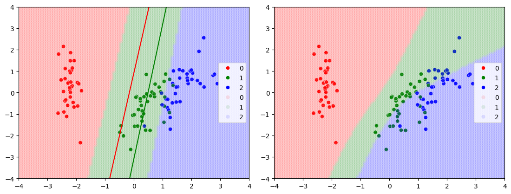

# Visualization and Comparison of Decision Boundaries: Logistic Regression vs Multilayer Perceptron (MLP) Implemented from Scratch on the Iris Dataset
The project focuses on comparing the decision boundaries of Logistic Regression and Multilayer Perceptron models fit on the Iris Dataset. The Logistic Regression and Multilayer Perceptron are implemented from scratch using numpy.

## Conclusion
The decision boundaries separate the dataset into multiple classes, as illustrated above. It is evident that the decision boundaries formed by the Multilayer Perceptron (MLP) are non-linear, while those created by Logistic Regression (LR) are linear. In the image on the right, the curved boundary of the MLP better captures the complex relationships in the data. In contrast, the decision boundaries of Logistic Regression, shown in the image on the left, are straight lines, reflecting the simpler, linear nature of the model. This highlights how MLP can model more intricate patterns compared to LR.
